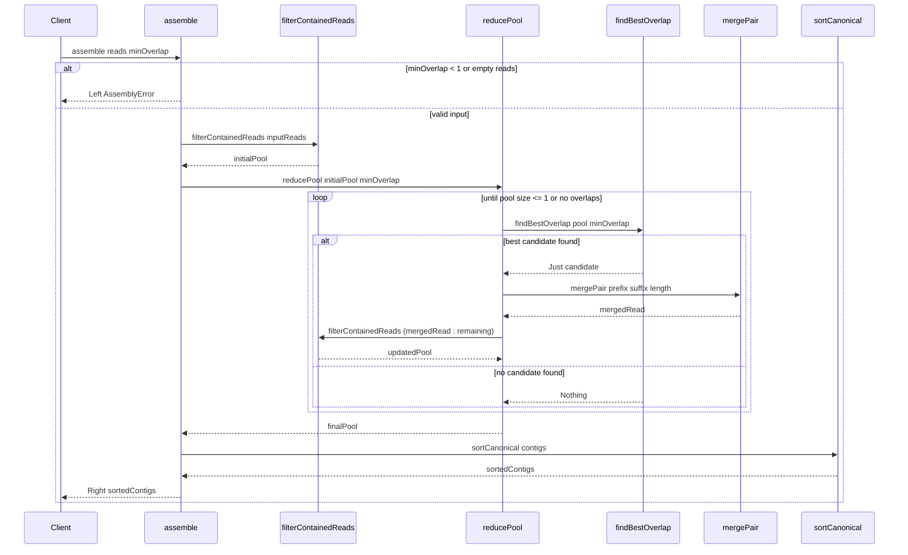

# Reconstruct Strings

A pure, total Haskell implementation of a greedy overlap sequence assembler
designed to reconstruct contiguous sequences (*contigs*) from short overlapping
string fragments or DNA sequencing reads.

## Overview

Reconstructing a DNA sequence from short read fragments—a foundational step in
*de novo* genome assembly—can be approximated through the Overlap-Layout-
Consensus (OLC) paradigm.

This project implements a deterministic, pure functional greedy overlap
reduction algorithm that:

- Validates input parameters totally without partial runtime exceptions.
- Deduplicates identical reads to a single representative sequence.
- Eliminates reads contained as proper substrings within longer reads.
- Merges the candidate pair with the longest valid suffix-prefix match.
- Resolves ties deterministically using a strict three-tier total order.
- Dynamically purges reads engulfed by newly formed composite contigs.
- Terminates when no pairwise overlap satisfies the minimum threshold.
- Sorts final contigs into a canonical, permutation-invariant order.

## Algorithm Workflow

The following sequence diagram illustrates the core assembly pipeline. After
validating inputs, `assemble` filters contained reads, then enters a recursive
reduction loop that greedily merges the best overlapping pair and re-filters the
pool until no further merges are possible. The surviving reads are converted to
contigs and sorted into canonical order.



## Usage

### Command-Line Execution

Run the assembler directly using Cabal:

```bash
cabal run reconstruct-strings -- -m 2 ATGGC GGCGT CGTGCA
```

Output:

```text
ATGGCGTGCA
```

### Options

- `-m`, `--min-overlap INT`: Minimum overlap threshold (default: `2`).
- `-f`, `--file FILE`: Read fragments from a file (one read per line).
- `READ...`: Read fragments passed as positional arguments or piped via `stdin`.

### Generating Synthetic Reads

You can generate synthetic reads (strands) from a contiguous text file using the
included shell script:

```bash
./scripts/make-strands.sh \
  --input reference.txt --min 10 --max 50 --count 100 > reads.txt
```

### End-to-End Simulation Pipeline

You can verify assembly accuracy against known reference data using a synthetic
generation and reassembly pipeline:

1. Create synthetic reference data:

   ```bash
   cat /dev/urandom | tr -dc 'ATGC' | fold -w 64 | head -n 10 > sample.txt
   ```

2. Fragment the reference sequence into reads:

   ```bash
   ./scripts/make-strands.sh -i sample.txt -m 8 -M 60 -n 1000 > strands.txt
   ```

3. Reassemble the fragmented strands:

   ```bash
   cabal run reconstruct-strings -- -m 4 -f strands.txt 2>/dev/null \
     | fold -w 64 > reconstructed.txt
   ```

4. Compare expected versus assembled sequences:

   ```bash
   sdiff -s sample.txt reconstructed.txt
   ```

## Build and Development

The project uses [Cabal][cabal-url] and a `Makefile` task runner.

### Common Make Targets

- `make` (or `make default`): Formats, lints, builds, and runs the test suite.
- `make all`: Runs the full pipeline including documentation and sample
  execution.
- `make format`: Formats source files with `stylish-haskell` and Cabal files
  with `cabal-fmt`.
- `make check`: Generates ctags and runs static analysis with `hlint` and
  `cabal check`.
- `make build`: Compiles the library, executable, and test suite with Cabal.
- `make test`: Executes unit tests and property tests.
- `make doc`: Generates Haddock documentation with hyperlinked source code.
- `make exec`: Executes sample sequence assembly runs.
- `make clean`: Cleans build artifacts and tags.

## Project Structure

- [`reconstruct-strings.cabal`][cabal-file]: Package configuration declaring
  build dependencies, compiler flags, and components.
- [`Makefile`][makefile]: Development automation targets for formatting,
  linting, building, testing, and documentation generation.
- [`src/Assembler.hs`][src-assembler]: Core greedy reduction logic and
  containment filtering.
- [`src/Assembler/Types.hs`][src-assembler-types]: Domain newtypes (`Read`,
  `Contig`), candidate records, and error types.
- [`app/Main.hs`][app-main]: Command-line interface with option parsing.
- [`test/Spec.hs`][test-spec]: Test driver with `hspec-discover`.
- [`test/AssemblerSpec.hs`][test-assembler-spec]: Hspec and QuickCheck test
  suite.
- [`docs/reconstructing-complete-dna-strand-from-short-fragments.md`][dna-doc]:
  Background information on DNA sequencing and assembly.
- [`docs/REQ-001-functional-greedy-overlap-assembler.md`][req-001]: Formal
  functional specification and architectural decision records (ADRs).
- [`docs/REQ-002-shell-script-to-make-strands.md`][req-002]: Requirements and
  ADRs for the synthetic strand generator script.
- [`docs/GLOSSARY.md`][glossary]: Domain terminology and definitions.

## Assembly Dynamics and Parameter Heuristics

Assembler performance depends on the interaction between alphabet size, read
length, minimum overlap threshold, and sequencing coverage.

### Alphabet Size and Collision Probability

The probability of an incidental prefix-suffix match of length $k$ between two
independent random sequences over an alphabet $\Sigma$ scales exponentially:

$$P(\text{overlap} \ge k) = \left(\frac{1}{|\Sigma|}\right)^k$$

Comparing a 4-character nucleotide alphabet (`ATGC`) with a 26-character
alphabet (`A-Z`):

- **$k = 2$**:
  - `ATGC`: $(1/4)^2 = 1/16 = 6.25\%$
  - `A-Z`: $(1/26)^2 = 1/676 \approx 0.148\%$ ($\approx 42\times$ rarer)
- **$k = 3$**:
  - `ATGC`: $(1/4)^3 = 1/64 \approx 1.56\%$
  - `A-Z`: $(1/26)^3 \approx 0.0057\%$ ($\approx 274\times$ rarer)
- **$k = 4$**:
  - `ATGC`: $(1/4)^4 = 1/256 \approx 0.391\%$
  - `A-Z`: $(1/26)^4 \approx 0.000219\%$ ($\approx 1{,}785\times$ rarer)

### Impact on Assembly Behaviour

- **Unrelated Random Noise**: When assembling random reads without a shared
  reference sequence, `ATGC` collapses reads into spurious contigs due to
  frequent coincidental matches. Conversely, `A-Z` reads rarely share accidental
  overlaps, causing the greedy reduction in [`Assembler.hs`][src-assembler] to
  halt immediately without merges. The apparent assembly of small alphabets is
  an illusion caused by chimeric joins.
- **Sensitivity to Coverage Gaps**: Over `A-Z`, 4-mers are statistically
  unique ($1$ in $456{,}976$). If physical coverage has a gap where adjacent
  reads overlap by less than $m$, the assembler halts and outputs fragmented
  contigs. In `ATGC`, chance 4-mer matches across distant regions can falsely
  bridge coverage gaps, resulting in scrambled assemblies.
- **Repeat Ambiguity**: In `ATGC`, short sequences rapidly exhaust unique
  permutations ($4^4 = 256$), causing repeated $k$-mers that trap greedy
  heuristics in local optima. In `A-Z`, high information entropy virtually
  eliminates repeats in moderate-length sequences.

### Minimum Overlap Lower Bound

For a pool of $N$ reads, there are $N(N - 1)$ ordered pairwise comparisons in
[`findBestOverlap`][src-assembler]. To ensure the expected number of false
positive pairwise matches across the dataset is less than 1:

$$E[\text{spurious pairs}] \approx N^2 \cdot |\Sigma|^{-m} < 1$$

$$\implies m_{\text{min}} = \lceil 2 \log_{|\Sigma|} N \rceil$$

- For $N = 1{,}000$ in `ATGC`: $m_{\text{min}} = \lceil 2 \log_4 1000 \rceil
  = 10$ bases.
- For $N = 1{,}000$ in `A-Z`: $m_{\text{min}} = \lceil 2 \log_{26} 1000
  \rceil = 5$ characters.

### Minimum Overlap Upper Bound

Under the Lander–Waterman model of sequencing, adjacent fragments in the
reference must overlap by at least $m$ to be detected. Given average fragment
length $\bar{L}$, the effective coverage $C_{\text{eff}}$ is:

$$C_{\text{eff}} = C \cdot \left(1 - \frac{m}{\bar{L}}\right)$$

where $C = \frac{N \cdot \bar{L}}{G}$ is nominal physical coverage for a target
of length $G$. As $m \to \bar{L}$, $C_{\text{eff}} \to 0$, causing exponential
fragmentation into separate contigs.

- **Rule of thumb**: Keep $m \le 0.5 \cdot \bar{L}$ to preserve at least 50% of
  nominal coverage.

### Fragment Length Requirements

- **Repeat Resolution**: To resolve repetitive elements, fragment length must
  strictly exceed the longest repeat length: $L > R_{\max}$.
- **Length Distribution**: Using variable fragment lengths (e.g. `--min` and
  `--max` in [`make-strands.sh`][make-strands]) breaks tie-breaking edge cases
  during greedy selection.

### Parameter Selection Guidelines

- **Minimum Overlap ($m$)**:
  - Set $m = \max\left(\lceil 2 \log_{|\Sigma|} N \rceil, \; 0.3 \cdot
    \bar{L}\right)$.
  - Typical range: **30%** to **50%** of average fragment length $\bar{L}$.
- **Fragment Length ($L$)**:
  - Ensure $L > R_{\max}$ (longer than the longest repeat).
  - Typical range: **$2\times$** to **$3\times$** the overlap threshold $m$.
- **Coverage Depth ($C$)**:
  - Target $C_{\text{eff}} = C(1 - m/\bar{L}) \ge 10$.
  - Nominal physical coverage: **$15\times$** to **$30\times$**.

#### Worked Configuration Examples

The following calibrated configurations illustrate parameter selection for a
target sequence of length $G = 1{,}000$ units and $N = 1{,}000$ fragments:

- **Genomic reads (`ATGC`, $|\Sigma| = 4$)**:
  Incidental overlap collisions scale as $(1/4)^k$, requiring higher overlap
  thresholds and longer reads to prevent false joins.
  - Fragment length range: $20\text{--}40$ bp (mean $\bar{L} = 30$ bp).
  - Minimum overlap: $m = 10$ bases
    ($m_{\min} = \lceil 2 \log_4 1000 \rceil = 10$,
    $E[\text{spurious}] \approx 0.95 < 1$).
  - Coverage: nominal $C = 30\times$, effective
    $C_{\text{eff}} = 30(1 - 10/30) = 20\times \ge 10\times$.
  - Sample commands:

    ```bash
    ./scripts/make-strands.sh \
      -i reference_genome.txt -m 20 -M 40 -n 1000 > reads.txt
    cabal run reconstruct-strings -- -m 10 -f reads.txt
    ```

- **String character reads (`A-Z`, $|\Sigma| = 26$)**:
  Higher entropy ($(1/26)^k$) drastically reduces collision probability,
  permitting smaller thresholds and shorter reads without chimera formation.
  - Fragment length range: $10\text{--}20$ chars (mean $\bar{L} = 15$ chars).
  - Minimum overlap: $m = 5$ characters
    ($m_{\min} = \lceil 2 \log_{26} 1000 \rceil = 5$,
    $E[\text{spurious}] \approx 0.084 \ll 1$).
  - Coverage: nominal $C = 15\times$, effective
    $C_{\text{eff}} = 15(1 - 5/15) = 10\times \ge 10\times$.
  - Sample commands:

    ```bash
    ./scripts/make-strands.sh \
      -i reference_text.txt -m 10 -M 20 -n 1000 > strands.txt
    cabal run reconstruct-strings -- -m 5 -f strands.txt
    ```

- **Comparative summary**:
  - Alphabet size: $4$ (`ATGC`) versus $26$ (`A-Z`).
  - Overlap threshold: $m = 10$ bases versus $m = 5$ characters ($E < 1$).
  - Fragment length: $20\text{--}40$ bp versus $10\text{--}20$ characters.
  - Nominal coverage: $30\times$ versus $15\times$ physical depth.
  - Effective coverage: $20\times$ versus $10\times$ Lander–Waterman depth.

## Continuous Integration

GitHub Actions pipeline configuration is defined in
[`.github/workflows/haskell.yml`][github-actions], which automatically compiles,
tests, and validates documentation builds on pushes and pull requests.

## References

- [REQ-001 Functional Greedy Overlap Assembler Specification][req-001]
- [REQ-002 Create Text Strands][req-002]
- [Reconstructing DNA from Short Fragments][dna-doc]
- [Domain Glossary][glossary]

[app-main]: app/Main.hs
[cabal-file]: reconstruct-strings.cabal
[cabal-url]: https://www.haskell.org/cabal/
[dna-doc]: docs/reconstructing-complete-dna-strand-from-short-fragments.md
[github-actions]: .github/workflows/haskell.yml
[glossary]: docs/GLOSSARY.md
[make-strands]: scripts/make-strands.sh
[makefile]: Makefile
[req-001]: docs/REQ-001-functional-greedy-overlap-assembler.md
[req-002]: docs/REQ-002-shell-script-to-make-strands.md
[src-assembler-types]: src/Assembler/Types.hs
[src-assembler]: src/Assembler.hs
[test-assembler-spec]: test/AssemblerSpec.hs
[test-spec]: test/Spec.hs
